<div align="center">
  
</div>

<div align="center">
  
</div>

<br/>

<div align="center">
  <a href="https://hekimalabs.tech">
    
  </a>
  <a href="https://billymwangi.com">
    
  </a>
  <a href="mailto:billymwangi200@gmail.com">
    
  </a>
  <a href="https://linkedin.com/in/billymwangi">
    
  </a>
</div>

<br/>

<div align="center">
  
</div>

## Who I Am

> **Hekima** is Swahili for *Wisdom*. We apply it.

I'm **Billy Mwangi**, founder of **[Hekima Labs](https://hekimalabs.tech)** and a **Claude Expert** in the Anthropic ecosystem. Based in Nairobi, Kenya, I build AI and automation systems that close **The Gap**: the disconnect between where African businesses store data and where decisions actually get made.

I work with fast-growing Kenyan SMEs and enterprise teams to replace Excel bottlenecks, reporting silos, and manual workflows with intelligent, documented, and team-owned systems.

- Founder and lead architect at **Hekima Labs** (AI & Automation Studio, Nairobi)
- Claude Community Leader for Kenya in the Anthropic ecosystem
- Africa-first LLM pipeline and workflow builder
- ALX Professional Foundations graduate

<div align="center">
  
</div>

## What I Build

```
Systems Architecture   ->  Custom web apps, internal tools, business platforms
AI Workflows           ->  LLM pipelines, automation systems, intelligent agents  
Training & Adoption    ->  Team enablement, AI habit formation, documentation
```

<div align="center">
  
</div>

## Tech Stack

**Languages**


**Frameworks & Libraries**


**Infrastructure & AI**


<div align="center">
  
</div>

## GitHub Stats

<div align="center">
  
  
</div>

<div align="center">
  
</div>

<br/>

<div align="center">
  
</div>

<br/>

<div align="center">
  
</div>

<div align="center">
  
</div>

## Featured Projects

<div align="center">

| Project | Description | Stack |
|---|---|---|
| [**LAI Group KE**](https://github.com/BillyMwangiDev/LAI-GROUP-KE) | Kenya's most curated luxury short-stay platform. Architecturally unique properties — from signature mabati-clad mansions to sustainable forest retreats — bookable directly via WhatsApp. Live at [lai.africa](https://lai.africa) | Next.js 15, TypeScript, Sanity CMS, Tailwind, Framer Motion |
| [**Ascribe**](https://github.com/BillyMwangiDev/Ascribe) | Tenant self-service portal for residential property management. Phone login, unit assignment, invoices, M-Pesa payments, statements, and receipts in one app | Expo SDK 54, React Native, TypeScript, TanStack Query, M-Pesa |
| [**BizKit**](https://github.com/BillyMwangiDev/Bizkit) | Mobile-first business document generator for freelancers and SMEs. Enter your details once and auto-populate branded invoices, quotations, receipts, and proformas, exportable as PDF — no design skills needed | Expo SDK 56, React Native, TypeScript, Zustand, expo-print |
| [**Keja**](https://github.com/BillyMwangiDev/Keja) | Mobile-first property rental platform for Nairobi. Eliminates agent fees, verifies listings via National ID + property deed, and integrates M-Pesa STK Push with geospatial search | FastAPI, React Native, PostgreSQL + PostGIS, M-Pesa |
| [**MIFUGO**](https://github.com/BillyMwangiDev/MIFUGO-MANAGEMENT) | IoT cattle tracking and health monitoring platform. Real-time GPS via smart collars, geofencing, estrus/sickness detection, theft alerts, and USSD access for feature-phone herders | FastAPI, Next.js, MQTT, PostGIS, ESP32, Africa's Talking |
| [**Trading Dashboard**](https://github.com/BillyMwangiDev/Trading-dashboard) | Full-stack XAU/USD trading terminal with live candlestick charts, 7 technical indicators, AI quant analyst powered by Claude, risk management, and trade journaling | React, TypeScript, Node.js, WebSocket, Claude API |
| [**Stock Soko**](https://github.com/BillyMwangiDev/Stock-Soko) | NSE mobile trading platform with AI buy/sell/hold signals, real-time portfolio tracking, M-Pesa deposits/withdrawals, and 24 built-in learning modules | FastAPI, React Native, PostgreSQL, Redis, Celery, M-Pesa |
| [**DukaPOS**](https://github.com/BillyMwangiDev/DukaPOS) | Offline-first Windows POS for Kenyan retail SMEs. Runs fully without internet, supports barcode scanning, multi-tender checkout (Cash + M-Pesa + Credit), and KRA eTIMS export | Electron, FastAPI, React, TypeScript, SQLite, M-Pesa |
| [**Learn Simu Grow**](https://github.com/BillyMwangiDev/learn-simu-grow) | Offline-capable EdTech PWA for Kenyan learners. Structured courses, voice-based pronunciation lessons, daily quizzes, gamification, and a local job board | React, TypeScript, Vite, Web Speech API, Service Workers |

</div>

<div align="center">
  
</div>

## Let's Build Together

<div align="center">

If you're a Kenyan or African business ready to close The Gap between your data and your decisions, let's talk.

  <br/>

  <a href="https://hekimalabs.tech">
    
  </a>

</div>

<br/>

<div align="center">
  
</div>
